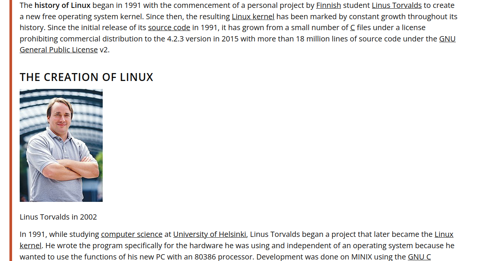

# Deliverable 1

## Introduction
Ubuntu server is a server operating system,developed by **Canonical** and open source programmers from around the world.Ubuntu is a server that anyone can use.Its free available with both community and professional.It can serve up website,file shares and containers as well .

## Project hardware and software requirements
Ubuntu 20.04 server edition provides a common,minimalist base for a variety of server applications,such as file/print services,web hosting ,email hosting etc.This version supports four 64 bit architectures:
* amd64(Intel?AMD 64-bit)
* arm64(64-bit ARM)
* ppc64el(POWER8 and Power9)
* s390x (IBM Z and LinuxONE)
  
System requirements are:
* CPU: 1 gigahertz or better
* RAM: 1 gigabyte or more
* Disk: a minimum of 2.5 gigabytes
* 
## What is Linux?
Linux is the best-known and most-used open source operating system.It is supported on almost every major computer platform,including x86,ARM and SPARC.Its directly manages a systems hardware and resources like CPU,memory and storage.

### Short history of linux
Linux began in 1991 as a personal project.Its create a new free operating system kernel.The resulting **Linux kernel** has been marked by constant growth throughout its history.In the Linux community,different organizations have combined the available components differently.

### Linux distribution
* **Slackware**:slackware a oldest linux distribution .Linux operating system designed with the twin goals of ease of use and stability as top priorities.Slackware Linux provides new and experience users alike with a fully featured system.

* **Debian**: Debian is an operating system and a distribution of Free Software.The debian project is a community of developers and users that maintain the GNU OS based on open source software.
  
> **Debian based Linux Distribution**
> Ubuntu:Ubuntu is a linux distribution based on Debian.It is developed by Canonical and community of developers.It has three official editions desktop,server and core.
> Kali Linux: Kali linux is an open source.Debian based Linux distribution geared towards various information security tasks,such as Penetration testing,Security Research,Computer Forensics.

* Red Hat Enterprise Linux: Is a commercial Linux distribution developed by Red Hat.It has a server version and a desktop version.Red Hat has sponsored the CentOS project since 2014.

>Fedora: Fedora is a linux distribution developed by the Fedora Project sponsored mainly by Red Hat with support from other companies.There are different Fedora editions available: Workstation,Server,CoreOS and loT.Fedora Linux was launched in 2003.

## Open Source VS Closed Source
* Open source: Open source is software  is distributed under a licensing agreement which allows computer code to be shared,viewed and modified by other users and organizations.
* Closed Source: Closed source software is software the source code is not free available.Closed source software refers to the computer software which source code is closes means public is not given access the source code.
  
### Advantage of Open Source:
* **Free to use**
* **No authorized license required**
* **Developed by individual,group or organization**
* **Can be UI and API-focused**

### Advantage of Closed Source:
* **Users Friendly**
* **Less risk of hacking**
* **Technical support**
* **No compliance issue**
* **Receive Information instantly**
  

## The Free software movement:
Free software movement is a social movement with the goal of presence given freedoms for software users,namely the freedom to run the software.Free software puts its users in control of their own computing. Nowadays the free software movement goes far beyond developing the GNU system.There are the 4 freedoms of free movement which is inspect,use,modify and sell.

## Sources;
https://linuxscriptshub.com/history-of-linux/
https://www.mhcc.edu/OLHardwareSoftwareRequirements/
https://www.tecmint.com/linux-distro-for-power-users/
https://www.outsource2india.com/software/articles/open-source-software.asp
https://brandongaille.com/19-pros-and-cons-of-closed-source-software/
https://www.gnu.org/home.en.html
