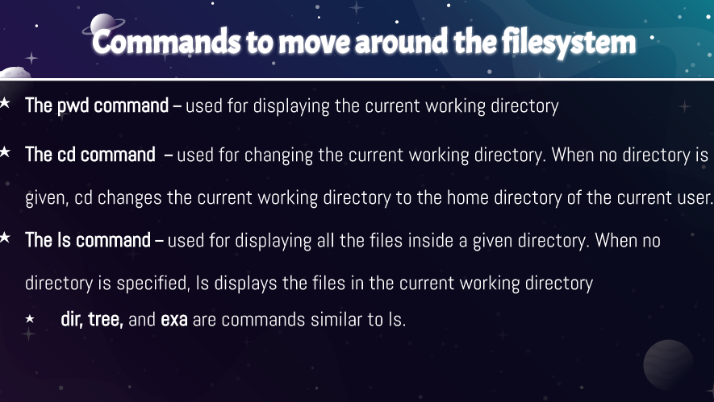

## What is Virtualization
Counterpart of hardware to imitate a virtual machine within a physical machine.Virtualization uses software to generate an synopsis layer on computer hardware that make a single computers hardware component processors and more to be sever into multiple virtual machine.

### Types of virtualization
## server-side virtualization
  Server side virtualization software serves up virtual machines.
  

  ## client-side virtualization
* software installed on a computer to manage virtual machine.
* Each VM has its own operating system installed.
  
### Hypervisor:
* A hypervisor that allows the management of virtual machines.
* Hardware support
* capable CPU
* Enough storage
### Two types of hypervisors

## Virtualbox
* Is a powerful type 2 virtualization product for enterprise as wellas home
* Open source software under GPL verion 2
* Runs on windows,Linux,Macintosh,solaris

### How to install virtualbox in windows 10
1) Download installer from [virtualbox.org](https://www.virtualbox.org/).
2) Start installer
3) once installer is done,install extention pack
4) select the amount of ram
5) create virtual hard drive
6) select ISO
7) finish installing
8) turn on the start menu
9) 

## Installing Ubuntu server
[ubuntu 20.04](https://cis106.com/guides/install-ubuntu-server-20.04/)

### Updating Ubuntu

* using ubuntu software update
*  
## Installing software
* Installation command examples
* Searching for software
* Deleting software
  * `sudo apt remove + package name`
  *  Example:
    * `sudo apt remove vlc`will remove the vlc package. 
searching 
* install option installs the specified package 
formula sudo + apt + install + package name
 some useful program 
* install several single command
* remove several programs in a single command
* install and remove programs in a single command
* remove programs and all remaining traces
* search for all programs that matches the text quotes
* search aal programs about given a package
* search package only

## Basic linux commands

   
#### mkdir
* Description:uded for created directories
* Usage: `mkdir + option + new directory path`
* Examples:
   * create a directory in the present working directory
   * `mkdir Wallpaper/'`
 * Create a parent directory and child directory
    * `mkdir Wallpaper/cars/new`
  
### Managing files and directories

