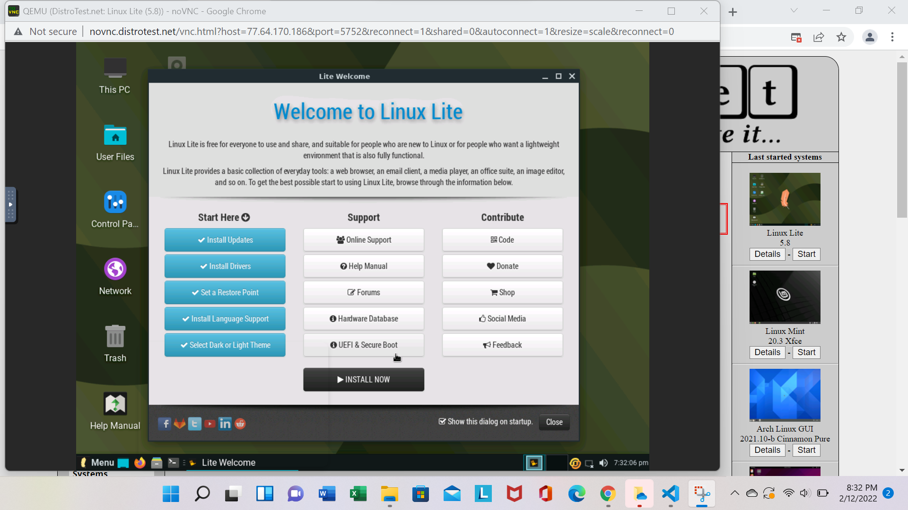
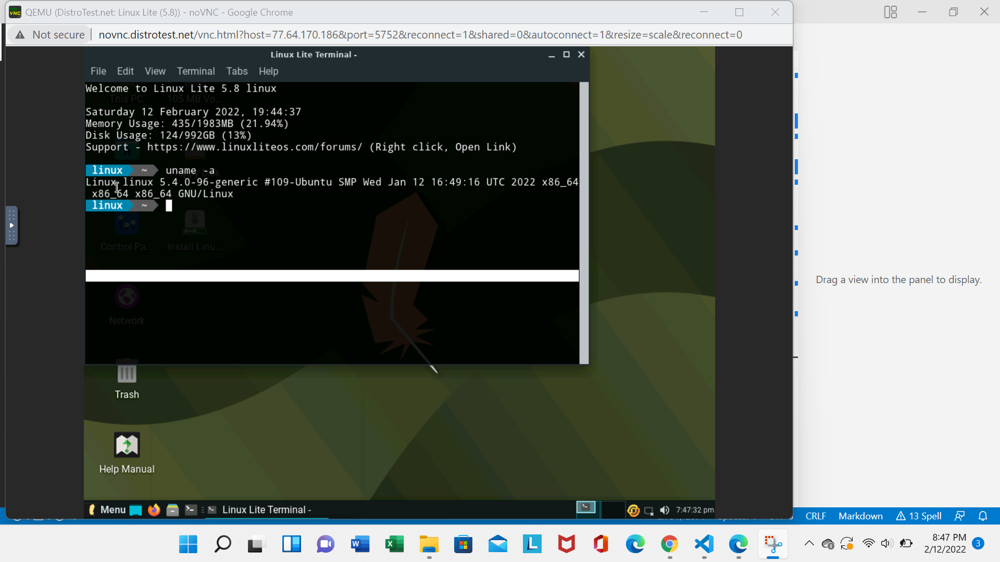
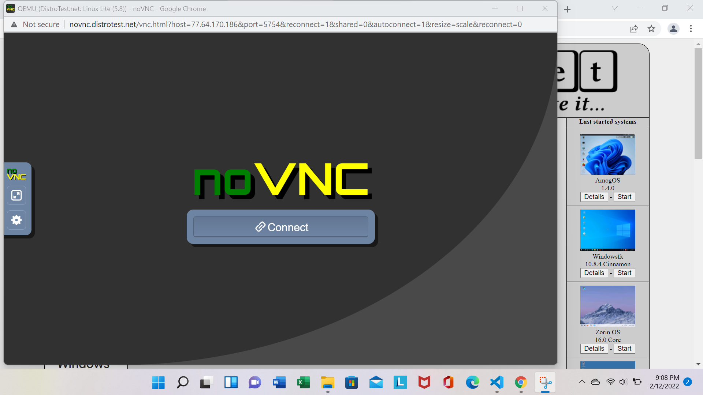

## Lab 1 Exploring Linux distributions

## Question 1
1. What is the OS Type: **Linux**
2. Which major distro is it based on? **Debian**
3. Which processor architecture does it support? **Architecture: armhf, ppc64el, riscv, s390x, x86_64**
4. Is the distribution active or is it discontinued? **Active**
5. What is the distro’s home page? **https://www.ubuntu.com/**

## Question 2
1. What is the name of the distribution and the OS Type: **Linux**
2. Which major distro is it based on? **Debian**
3. Which processor architecture does it support? **Architecture: aarch64, armhf**
4. Is the distribution active or is it discontinued? **Active**
5. What is the distro’s home page? **https://www.raspberrypi.org/**

## Question 3
1. What is the name of the distribution? **Linux**
2. What is the country of Origin? **Argentina**
3. What major distribution is it based on? **Arch**
4. What is the distribution category? **Desktop**
5. Which processor architecture, aside from the one in the original query, does the OS support? **Evbarm**
   
## Question 4
### A Linux distribution used for Data Rescue/Data recovery

| Distro name | Website                    | Desktop Environment |
|-------------|---------                   |---------------------|
|Kali linux   |https://www.raspberrypi.org/|   four popular desktop|                  
### A Linux distribution used for Education that supports the ix86 processor architecture.
| Distro name | Website              | Desktop Environment |
|-------------|---------             |---------------------|
|Linux Mint   |https://linuxmint.com/|   Linux Mint is compatible with Ubuntu software repositories|                  

### A Linux distribution that supports the OEM installation method
| Distro name | Website                  | Desktop Environment |
|-------------|---------                 |---------------------|
|Pop!_OS       |https://system76.com/pop/|the desktop without distractions in order to allow the user to focus on work|
## Question 5

## Question 6

