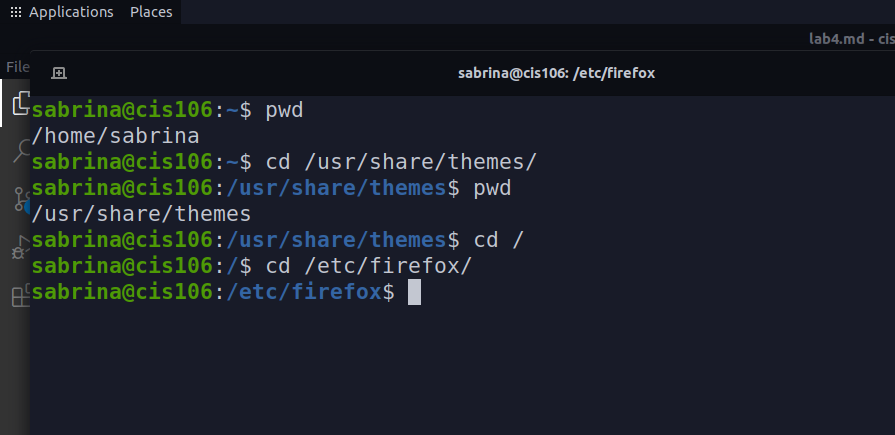
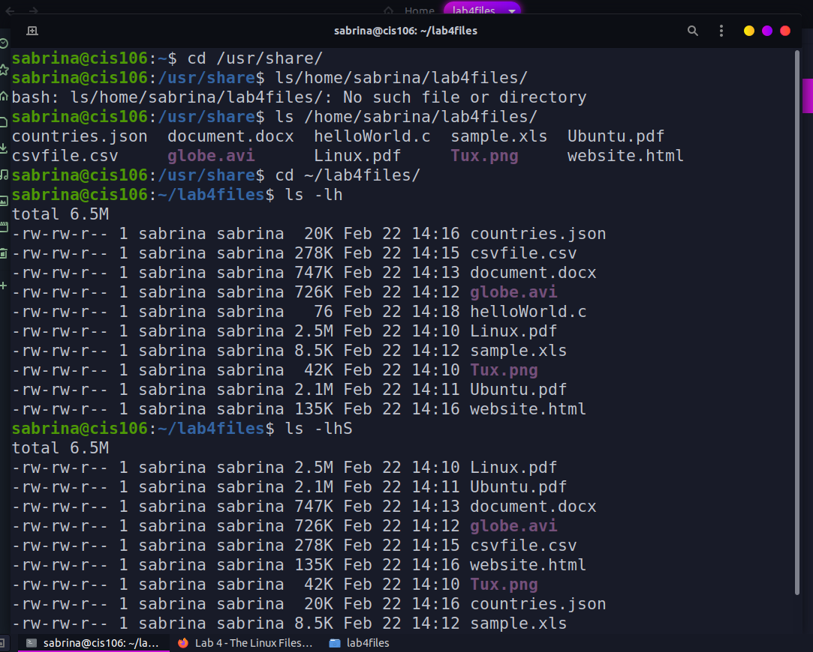
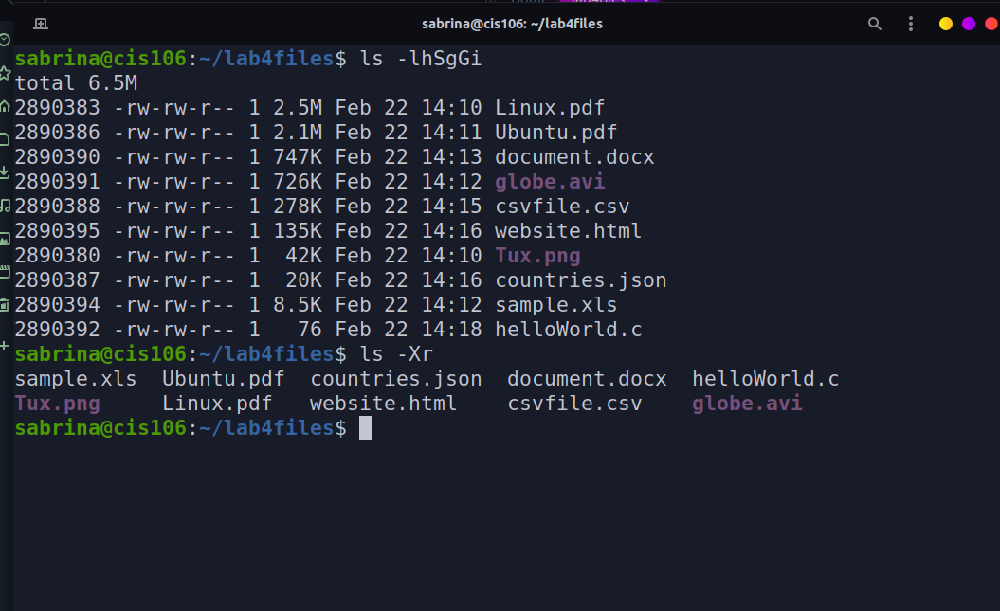
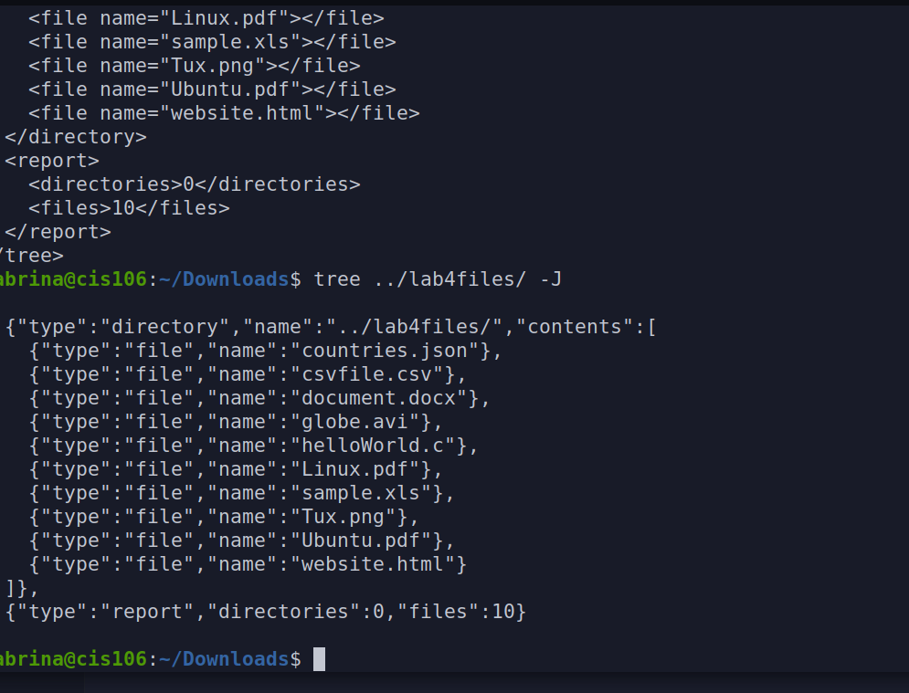
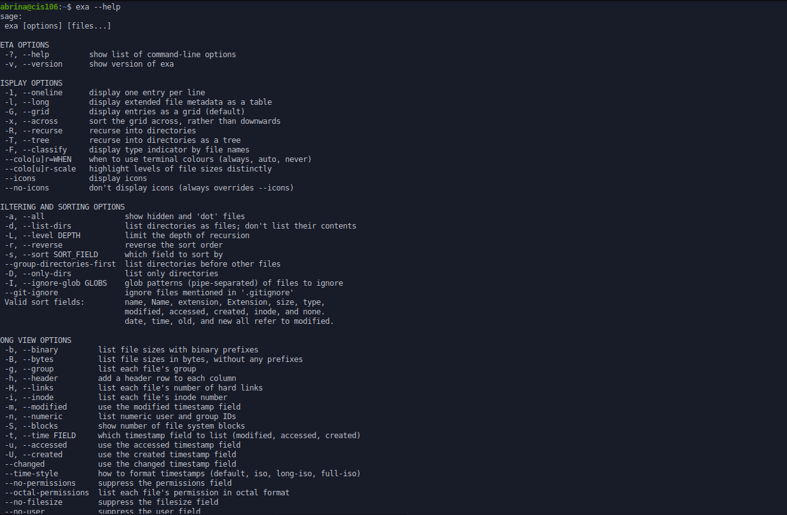

# Lab 4 THe Linux fs

## Question 1
### Table 1

|Directory | Function                                                         |
|----------|------------------------------------------------------------------|
|bin       | Essential commands.                                              |
|dev       | device files.                                                    |
|etc       |systems configuration files.                                      |
|home      | Users home directory.                                            |
|opt       |add software package                                              |
|proc      | Kernel information process control system hardware information.  |
|srv       | Information relating to service that run on the system.          |
|usr       | software not essential for system operation such as applications.|
### Table 2

|Command| What it does                                     | Syntax         | Example
|pwd    | displaying the current working directory         | pwd            | /home/jdoe     |
|cd     | changing the current working directory           | cd+ downloads/ | /downloads$ pwd|
|ls     | displaying all the field inside a given directory|----------------| ---------------|

## Screenshot

## Question 2

## Question 3

## Question 4

## Question 5

