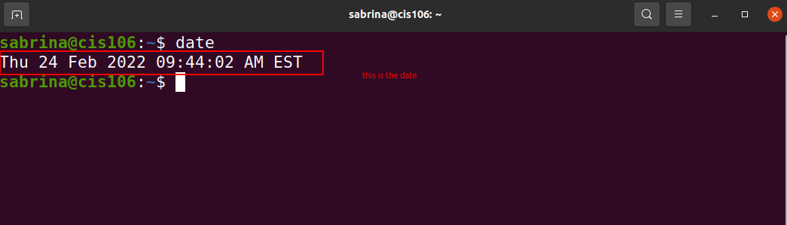
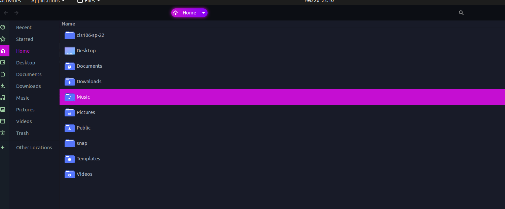
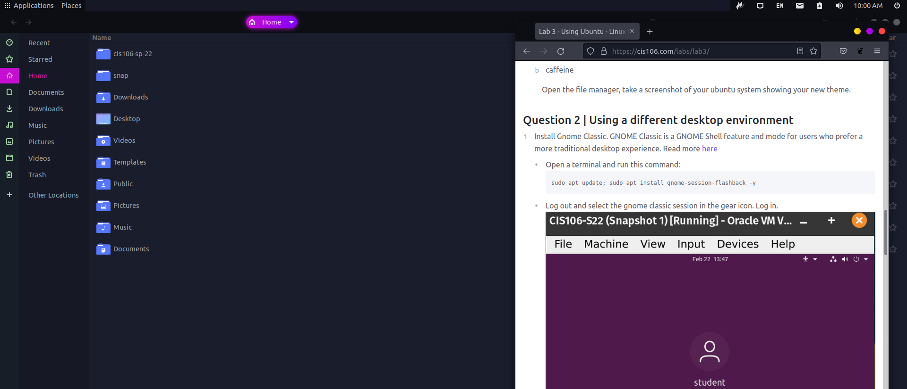

#  Lab 3 using Ubuntu

# Question 1

# Question 2

# Question 3

| Program purpose     | Package Name | Version            | Description                                            |
| ------------------- | ------------ | -------            | -----------                                            |
| Play a tetris game  | quadrapassel | 1:3.36.0-1         |tetris game                                             |         |                  |
| Play a video file   |   winff      |0.2.1+git20191128-1 |GUI for FFmpeg                                          |
| Browse the internet |tablet-encode | 2.30-0.            |video converter for Nokia Internet Tablets              |          
| Read your email     |  geary       |  3.36.1-1          |lightweight email client designed for the GNOME desktop |
| Play music          |   youtube-dl |2020.03.24-1        |downloader of videos from YouTube and other sites       | 

        

commands Answers:
* Sub question 1 `sudo apt install quadrapassel winff tablet-encode geary you tube -y `
* Sub question 2 `sudo apt remove quadrapassel winff tablet-encode geary you tube -y   `
* Sub question 3 `sudo apt purge quadrapassel winff tablet-encode geary you tube -y  `

# Question 4

| command | what it does                                     |
|---------|--------------                                    |
| echo    |display a line of text                            |
| fortune |print a random, hopefully interesting, adage      |
| cowsay  |configurable speaking/thinking cow (and a bit more|
| lolcat  |rainbow coloring for text                         |
| figlet  | No manual entry for figlet                       |
| toilet  |display large colourful characters                |
| rig     |Random Identity Generator                         |

