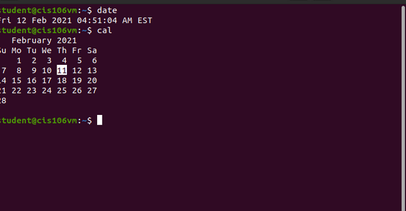
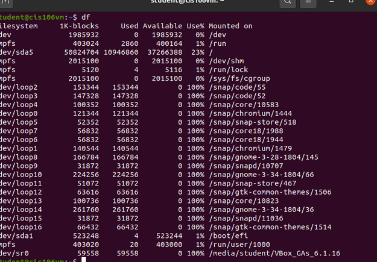
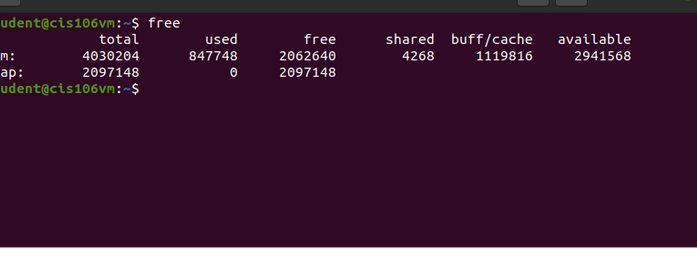
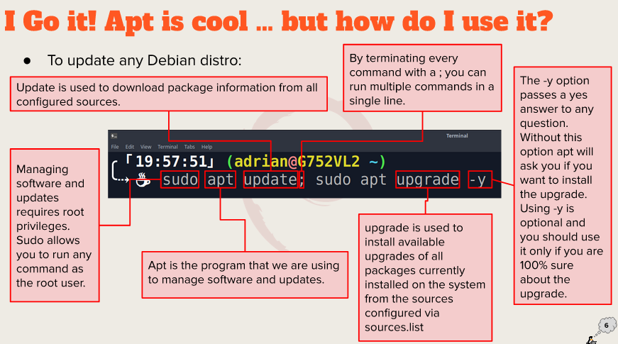
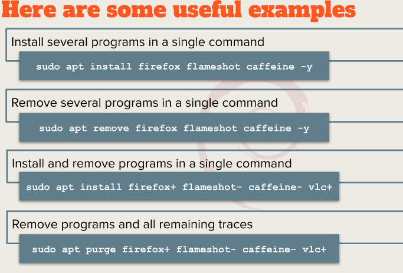
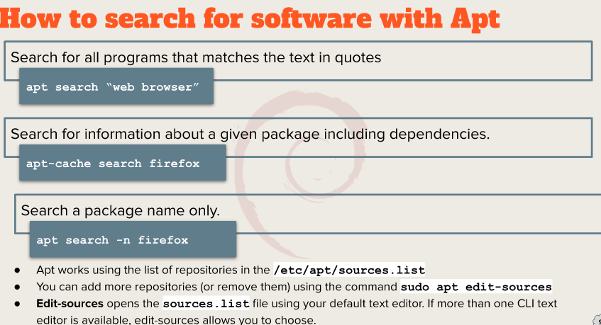
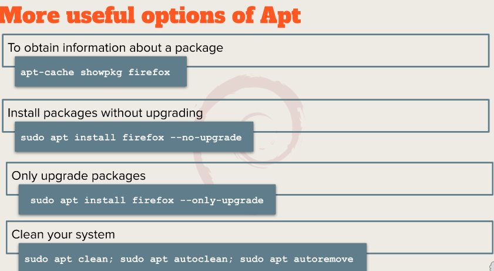

# Week report 3
## Summery of presentation
### a. Exploring Desktop Environments

## bulleted list of different desktop environments
* **LXQT**
* **Deepin**
* **Pantheon**
* **Raspberry Pi OS**
  
## Definitions for the following terms: 
* **GUI**: A graphical user interface is a form of user interface that allows users to communicate with the electronic systems via icons,windows and various other visual elements.
* **DE** :In computing ,the desktop is an embodiment of the desktop parabole made of bundle o programs running on top of a computer operating system that shares a common GUI ,sometimes described as a graphical shell.
  
## Bulleted list of the common elements of a desktop environment
* **GNOME**
* **KDE**
  
## b. The bash Shell

#### What is a shell?
A shell is a layer of  computer program which exposes an operating system's services to a human user or others.

## List different shells
- Tcsh Shell
- Csh Shell
- Ksh Shell
- Zsh shell
- Fish shell
  
### List some bash shortcuts 
* **Ctrl+A**: Go to the beginning of the line.
* **Ctrl+E**: Go to the end of the line.
* **Alt+B**: Go left (back) one word.
* **Ctrl+B**: Go left (back) one character.
* **Alt+F**: Go right (forward) one word.
* **Ctrl+F**: Go right (forward) one character.
  
### List basic commands and their usage
* **date**: displays the current time and date
* **cl**: calender of the current month
* **df**: the current amount of free space on our disk drives
* **free**: the amount of free memory
* **uname**: information about your system
* **clear**: clear the screen

## c. Managing Software 
### Command for updating ubuntu
sudo apt update 
### Command for installing software
sudo apt install app-name -y
### Command for removing software
sudo apt remove app- name -vlc+
### Command for searching for software
apt search "app name"
### Definition of the following terms:
* Package : archives that contains binaries of software,files and information about dependencies.
* Library: code can be used more than one function or program
* Repository : huge collection available for download

### The screenshot of how to update ubuntu with its explanation 

### cheat sheet

