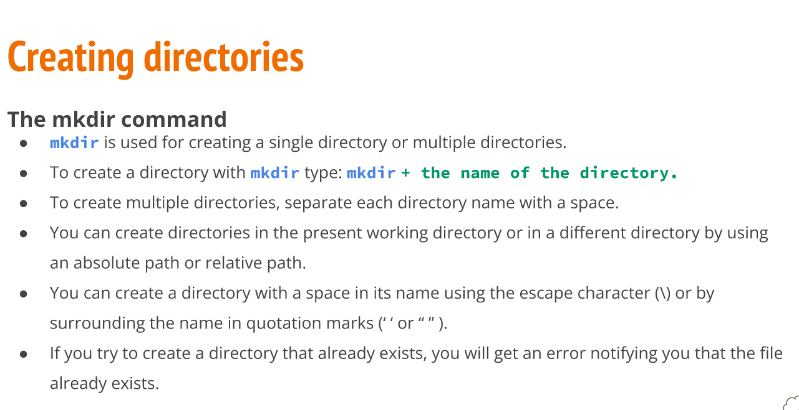
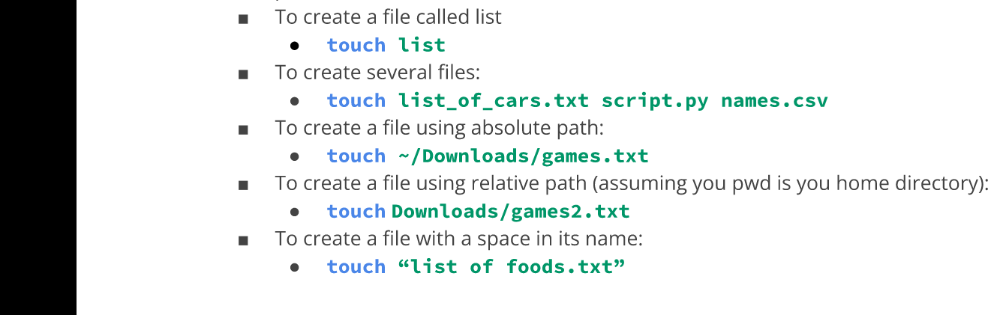
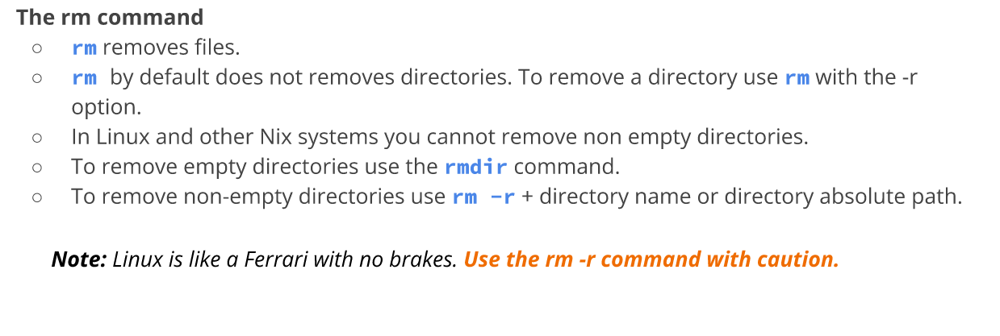
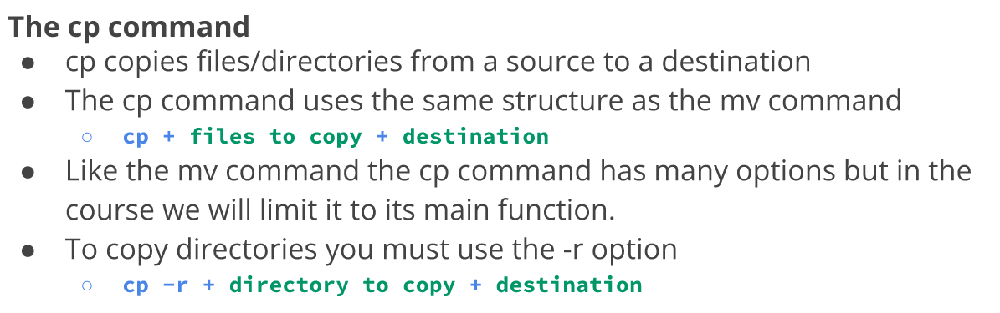
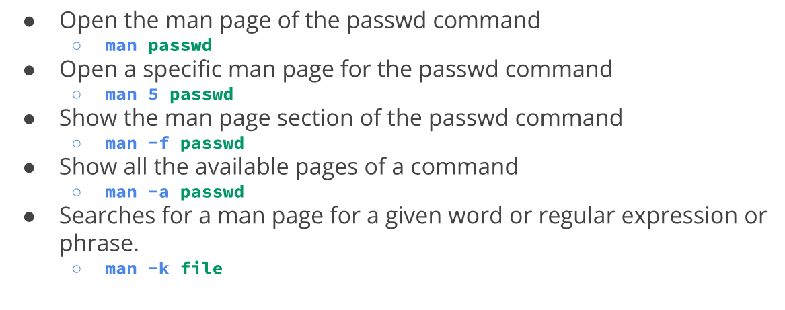

# Week report

# mkdir: 
this create a folder and specify in the folder you are in.
### Usage:
The mkdir command in Linux/Unix allows users to create or make directories.mkdir stands for make directory.mkdir can also set permissions,create multiple directories.
### Command:

# Touch:
Is a command used to update the access date and/or modification date of a computer file or directory
### Usage:
Creating files
### Command:

# rm:
rm is a basic command on Unix and Unix- like operating system to remove objects such as computer files,directories and symbolic
### Usage:
Delete files
### Command:

# rmdir:
Unix like operating system command
### Usage: 
This is also remove files and directories
### Command:
"empty directories"

# mv:
mv is a unix command that moves one or more files or directories from one place to another
### Usage:
The process variable or measured variable
### Command:

# cp:
cp is a command in various Unix and Unix like operating systems.
### Usage:
Coping files and directories
### Command:

# In:
Standard Unix command utility
### Usage:
To create hard link and symbolic link
### Command:
line utility for creating links between files

# man:
Is a form of software documentation usually found on a Unix or Unix like operating system
### Usage:
Display the user manual of any command that we can run on the terminal
### Command:

# Brace expansion

