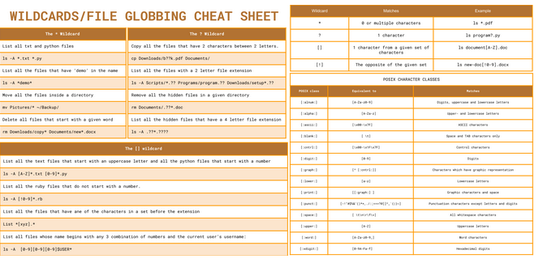
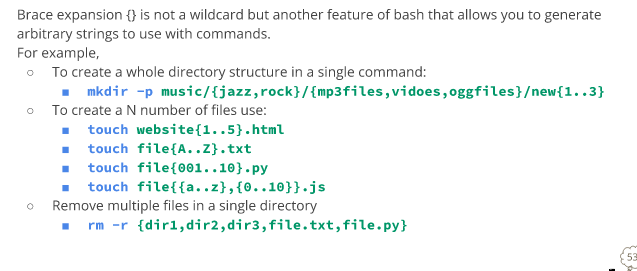

## Week report

# Wildcard:
 A wildcard is a sign that halt for other characters.This are generally used in shell commands in linux.
 

 # Brace expansion:
 Brace expansion is a effective skill for making a list of strings that can be used in the linux command line

