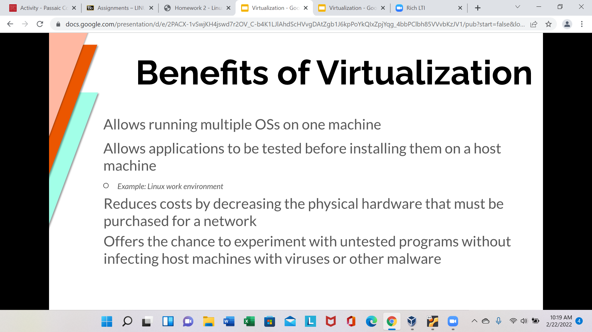
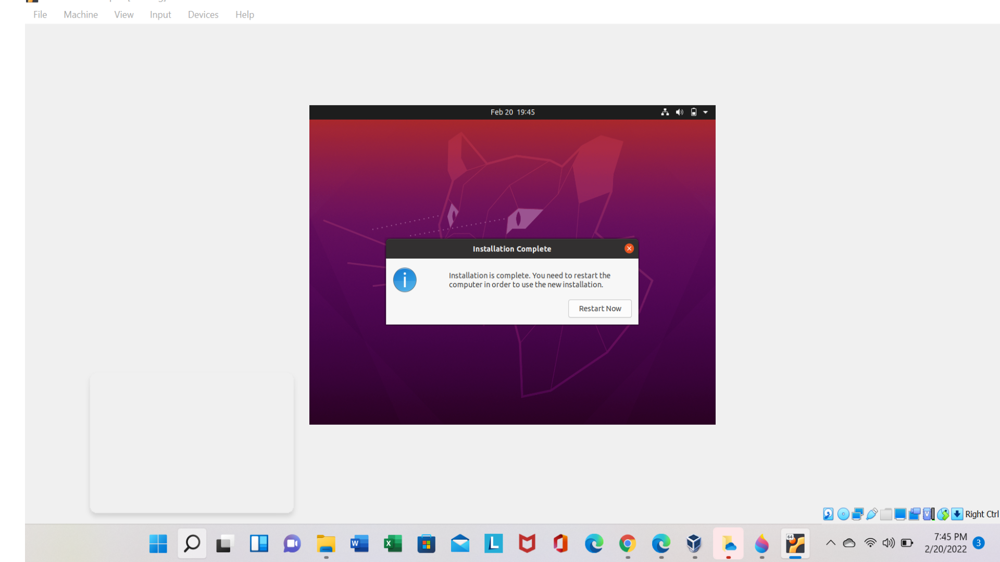
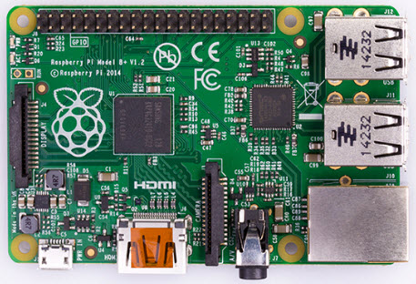
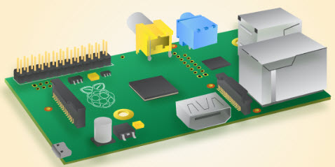
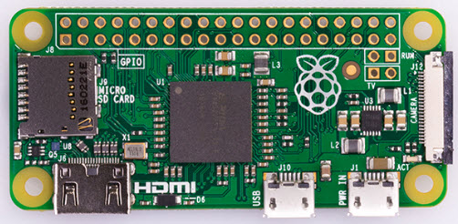
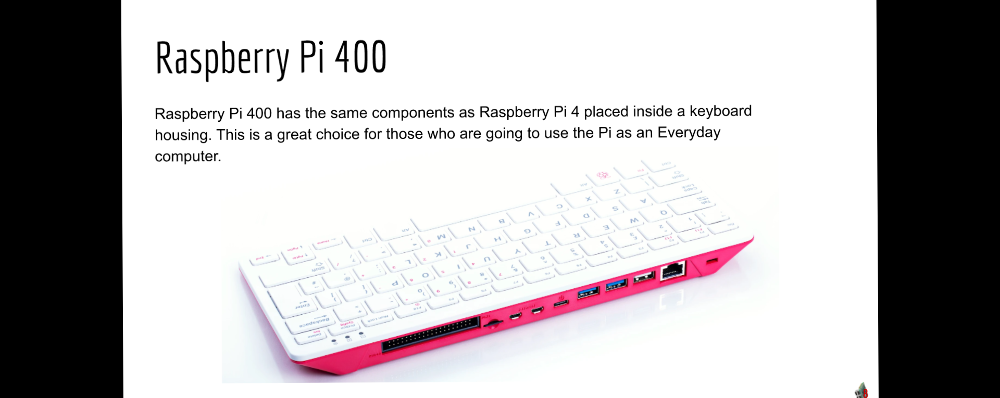

# week report 2
## Summary of presentations
# The basics of virtualization

# What is virtualization
Replication of hardware to simulate a virtual machine inside a physical machine.
# Types of virtualization
Two types of virtualization:
* server side virtualization
* client side virtualization
# anything else you find important

# Installing Ubuntu in Virtualbox

# What is the raspberry pi
Its a single board at its core it is a complete computer with all the stuff typical computer have but with a very small footprints and like computers it means operating system which is usually modified Linux version depending on the use case.Its GPIO ports .GPIO ports are physical pins on the board  that are programmable they can use either send voltage or even received data through electrical impulses.

Watch these videos before you read the presentation:
# what is the raspberry pi in 100 seconds?
It  tiny but it quite a powerful with a quad core processor and up to eight gigabytes of and building own iot prototypes robots security cameras web servers and many other fun projects.Raspberry pi use like a normal desktop computer by connecting a keyboard mouse and monitor.You can install any operating system but most beginners like linux raspberry pi os and when you in you can program take over the world.

# what is the raspberry pi?
It's a credit card computer that costs around 25 pounds and teach young people to program and is capable of doing all kinds of wonderful things.All over the world people are experiment with raspberry pi and they are using the pi in a variety of amazing interesting projects taking advantage of its size,portability,cost,programability and connectability .
# What is a raspberry pi
It is a low cost,credit card sized computer that plugs computer tv,monitor and standard keyboard and mouse.Its doing everything same desktop computer do.
# A bulleted list of different models

# specs of the latest model (Raspberry pi 4 or 400) you can use a screenshot

# Bulleted listed of 5 projects you can do with a raspberry pi. Use the internet to find this information
Language translator
Remote control 3D printer
Security camera
PC Hardware Stats monitor
Game console
